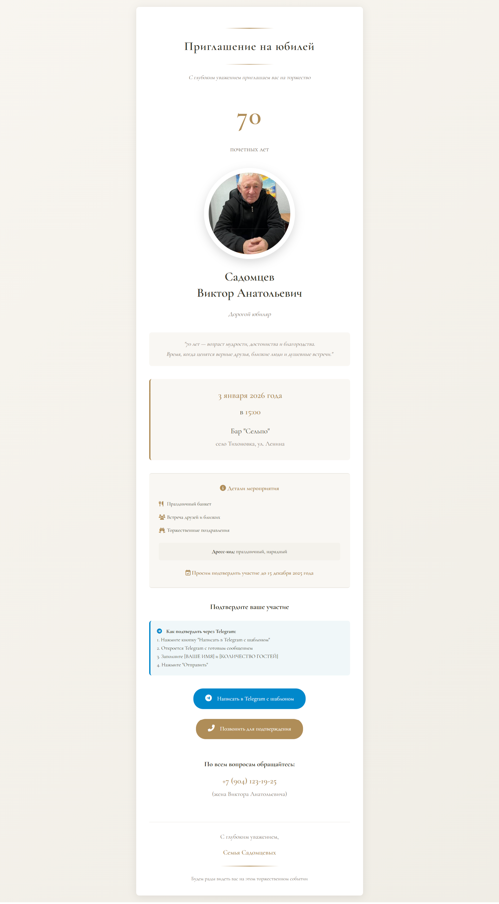

## 🥳 Приглашение на юбилей
Этот проект представляет собой статическую веб-страницу — элегантное цифровое приглашение на 70-летний юбилей. Страница свёрстана с учётом красивого отображения в социальных сетях (Open Graph) и содержит удобные кнопки для подтверждения участия через Telegram или по телефону.

## 🔗 Демо: https://bukh-sun.github.io/jubilee/

## 📸 Скриншот



## ✨ Особенности
Адаптивный дизайн — корректно отображается на мобильных устройствах, планшетах и десктопах.

Open Graph мета-теги — при отправке ссылки в Telegram, WhatsApp или другие соцсети формируется красивая карточка с изображением, заголовком и описанием.

Кнопка подтверждения в Telegram — при нажатии открывается Telegram с предзаполненным сообщением, содержащим всю необходимую информацию (дата, место, имя гостя и количество человек). Остаётся только ввести свои данные и отправить.

Кнопка звонка — для быстрой связи с организатором.

Запасной вариант для фотографии — если изображение юбиляра не загрузится, отображается стильный плейсхолдер с иконкой.

Изысканный дизайн — использован шрифт Cormorant Garamond, золотые акценты, тёплая цветовая гамма.

## 🛠 Настройка под своё мероприятие
Вы можете легко адаптировать этот проект для любого другого торжества. Для этого достаточно отредактировать файл index.html и заменить изображения.

1. Замените фотографию юбиляра
Положите в корневую папку свою фотографию (желательно квадратную, хорошего качества) и назовите её, например, photo.jpg. Затем в теге  укажите имя вашего файла.

2. Поменяйте текст
Имя юбиляра — встречается в нескольких местах: в заголовках, в мета-тегах, в блоке .name. Замените «Садомцев Виктор Анатольевич» на нужное имя.

Дата и время — найдите блок .date-place и измените дату, время, название и адрес места проведения.

Цитата — в блоке .quote можно написать своё пожелание или оставить как есть.

Дресс-код — при необходимости измените текст в блоке с классом details.

3. Обновите контактные данные
Telegram для подтверждения — в ссылке href у кнопки с классом telegram-button замените номер телефона (+79041231925) и текст сообщения на свои.
Формат: https://t.me/имя_пользователя?text=... или https://t.me/+79001234567?text=...

Номер телефона для звонков — измените ссылку tel:+79041231925 и отображаемый номер в блоке .contact-info.

Подпись «жена Виктора Анатольевича» — замените на соответствующий текст (или уберите).

4. Open Graph изображение (превью для соцсетей)
В мета-тегах og:image указан файл og-image.jpg. Замените этот файл на своё изображение размером 1200×630 пикселей, чтобы при отправке ссылки отображалась красивая карточка.

5. Срок подтверждения
В блоке .details есть строка «Просим подтвердить участие до 15 декабря 2025 года» — измените дату.

## 🧰 Технологии
HTML5

CSS3 (адаптивная вёрстка, градиенты, тени)

JavaScript (минимальный — для подмены фото при ошибке загрузки)

Google Fonts (Cormorant Garamond)

Font Awesome 6 (иконки)

Open Graph / Twitter Cards

## 🚀 Публикация на GitHub Pages
Репозиторий уже настроен на автоматическую публикацию через GitHub Pages. Чтобы опубликовать свою версию:

Сделайте форк этого репозитория или скопируйте файлы в свой репозиторий.

Внесите необходимые изменения (см. раздел «Настройка»).

В настройках репозитория (Settings → Pages) выберите ветку main (или master) и папку /root.

Через пару минут ваш сайт станет доступен по адресу https://ваш-логин.github.io/имя-репозитория/.

## 📁 Структура файлов
```text
jubilee/
├── index.html                     # Главная страница приглашения
├── photo.jpg  # Фото юбиляра
├── og-image.jpg                    # Изображение для превью в соцсетях
├── .gitignore                       # Исключённые файлы (например, .DS_Store)
└── README.md                        # Этот файл 
└── screenshot.png                    # Скриншот 
```
## 📄 Лицензия
Этот проект распространяется без ограничений — используйте его свободно для своих личных и семейных торжеств.